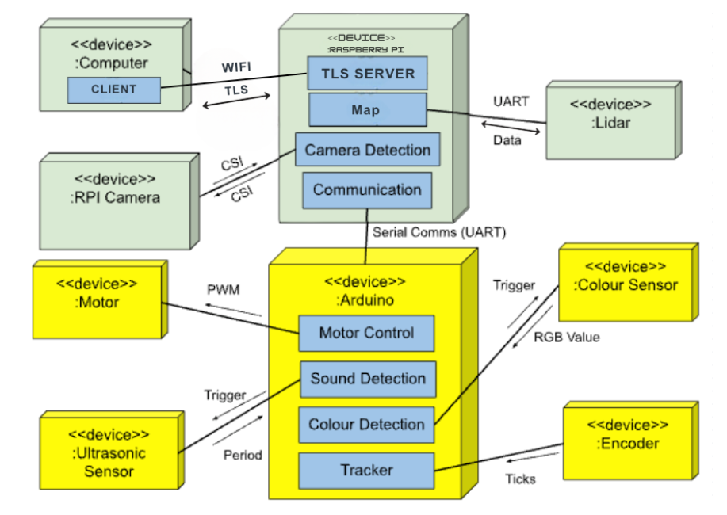
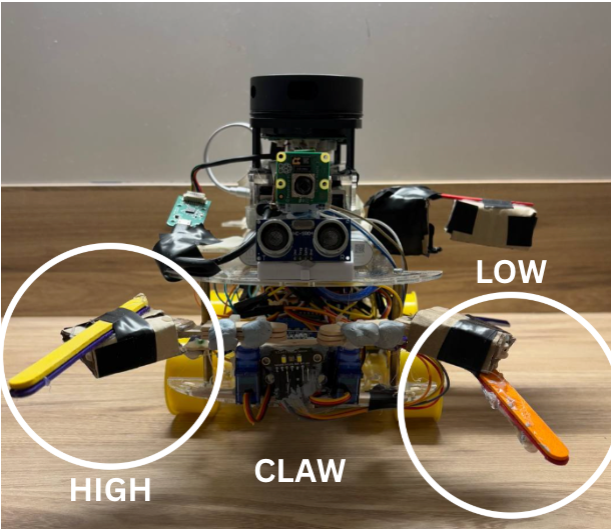
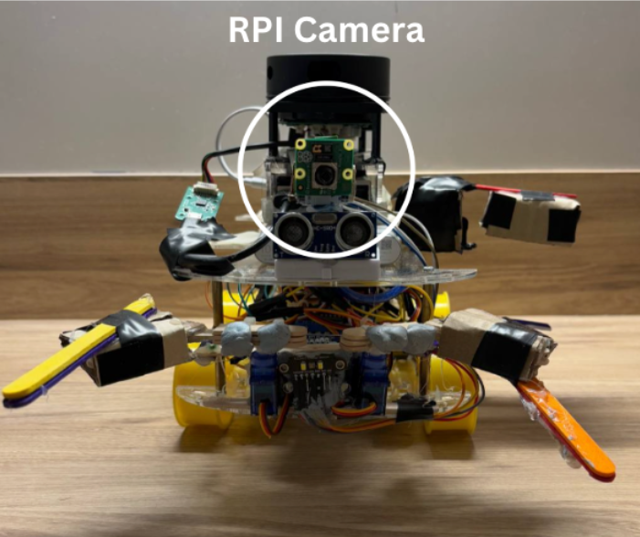
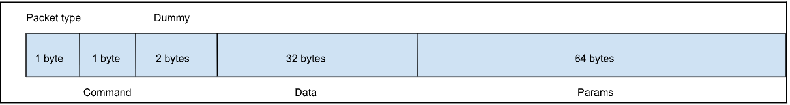

# CG2111A — "Alex to the Rescue"

> **CG2111A Engineering Principle and Practice II** | Semester 2, AY2024/2025 | Team B04-3A

A search-and-rescue robotic vehicle designed to navigate a simulated lunar environment, identify astronauts by colour, and carry out rescue operations autonomously via remote operator control.

## Contents

| Directory | Description |
|---|---|
| `Alex/` | Arduino code and header files for the robot |
| `calibration/` | Arduino code used for colour sensor calibration and testing |
| `source/` | TLS server (RPi) and client (Laptop) code, serial libraries, and header files |

## Introduction

Our robotic vehicle, **Alex**, is designed to carry out effective search-and-rescue operations within a simulated lunar environment. The primary functions include:

- **Remote Navigation** — Operators can precisely maneuver the vehicle forward, backward, and execute controlled rotations to avoid obstacles at least 21 cm high. Navigation is guided by real-time LIDAR mapping powered by Raspberry Pi.
- **LIDAR Mapping** — Using continuous LIDAR-based data, Alex accurately maps its surroundings, helping operators create a clear, hand-drawn map of its environment.
- **Astronaut Detection & Identification** — The system differentiates between astronauts requiring minimal medical assistance (Green) and those critically injured (Red) by sensing their colour via a colour sensor.
- **Rescue Operations** — The onboard robotic arm (claw), powered by servo motors, is designed to securely grip and relocate red astronauts safely to the designated safe zones. A revolving trap door is used to deliver the medpack to the green astronaut.
- **RPi Camera** — Operators have limited strategic use of an onboard Raspberry Pi camera (restricted to four activations lasting no more than ten seconds each) for visual assessment during critical rescue interactions, strictly not for navigation purposes.


*Figure 1: Diagram of System Architecture*

## System Architecture

### Core Components & Their Roles

- **Raspberry Pi (High-Level Processing)** — Acts as the central brain for decision-making, mapping, and vision processing.
- **Arduino (Low-Level Actuation & Sensing)** — Handles real-time motor control, sensor interfacing, and servo actuation.

### Key Communication Pathways

- Raspberry Pi ↔ Computer (User Interface)
- Raspberry Pi ↔ Arduino
- Raspberry Pi ↔ LiDAR
- Arduino ↔ Motors / Encoders / Sensors

### Sensor & Actuation Workflow

**Mapping & Navigation:**
1. LiDAR scans surroundings
2. Raspberry Pi builds 2D map
3. Path planning
4. Commands sent to Arduino
5. Motors execute movement
- *Fallback Mechanism:* Ultrasonic sensor detects close-range obstacles, triggering emergency stops.

**Astronaut Detection:**
- Navigating to the left and right of the object will reveal whether it is the edge of a wall or likely an astronaut (a red dot on the LIDAR map).
- Raspberry Pi Camera streams for 10s to confirm that it is an astronaut.
- The Ultrasonic Sensor detects if the astronaut is within grabbing range.
- Colour sensor detects RGB values to identify red or green astronauts grabbed by the claw.

**Movement & Odometry:**
- Wheel encoders track rotation ticks
- Arduino calculates distance
- Raspberry Pi updates real-time position on the map

## Hardware Design


*Figure 2: Front and Side Views of Alex with labels*

### Component Overview

| Component | Function |
|---|---|
| **Raspberry Pi** | Relays user commands to Arduino to control the motors, provides power to both Arduino and LIDAR, receives information from the LIDAR and sends collected data to the laptop |
| **Arduino Uno** | Receives motor control instructions from Pi, enacts commands for motor movements |
| **LIDAR** | Maps surrounding terrain, transmits collected data points back to Pi |
| **DRV-8833 Dual Motor Driver** | Drives speed and direction of motors, provides power from batteries to drive motors |
| **Ultrasonic Sensor (HC-SR04)** | Detects distance between sensor and objects in its vicinity |
| **Colour Sensor (TCS34725)** | Detects and measures red, blue, green and white light to compute colour |
| **Trapdoor** | An ice cream stick attached to a servo to operate the trapdoor mechanism and release medpacks to Green astronauts with minimal delay |
| **Claw** | Two servos form a two-joint claw system used to grip and drag Red astronauts to the designated safe zone |
| **RPi Camera** | Captures 10-second segments of black-and-white video and streams them on the server, providing a real-time visual context of Alex's surroundings |

### Placement of Components

**Ultrasonic Sensor (HC-SR04):**
The ultrasonic sensor is mounted at the front center of the top acrylic plate, aligned with the head of the astronaut and positioned centrally within the claw's span. It emits sound waves to measure distance and works alongside the LiDAR to determine when Alex is close enough to begin the rescue. Once a suitable range is detected, the robot automatically advances, decreasing the distance until the astronaut is within reach, triggering the claw to grab and drag the astronaut accurately.

**Claw:**
The elevation of the claw was carefully adjusted to grip around the centre of gravity of the Red astronaut, ensuring it was neither too low nor too high. This prevents toppling during gripping and movement, allowing for stable and secure handling. Cardboard extensions are added to the outer arms to increase surface area and enhance grip stability, while the inner arms are reinforced with double-layered ice cream sticks to provide added structural rigidity and prevent flexing under load. Additionally, each outer arm — one placed high and the other low — effectively pushes the astronaut toward the claw's embrace, helping Alex secure a firmer hold.


*Figure 6: Zoomed in view of Claw Placement*

**Colour Sensor:**
The colour sensor is fixed at the very front of the robot, positioned slightly below and between the pincers of the claw. This placement ensures that when Alex grips an astronaut, the sensor is brought into the closest possible proximity to it. By doing this, we minimise external light interference and maximise reading accuracy, allowing the sensor to capture precise RGB values for reliable colour classification.


*Figure 7: Zoomed in view of Colour Sensor*

**Trapdoor:**
The trapdoor is operated by a single servo motor positioned beneath the medpack storage area. This servo controls a hinged platform that holds the medpack in place during navigation. When a green coloured astronaut is sensed, the servo rotates to ensure the swift deployment of the medpack. The majority of the motion of deployment relies on gravity; our only focus is to make sure that medpack is firm in the clutch of the trapdoor during movements.


*Figure 8: Zoomed in view of Trapdoor*

**RPi Camera:**
Mounted at the front of Alex on top of the Ultrasonic sensor for a bird's eye-view — just nice enough yet not blocking the detection of our LIDAR — the RPi camera provides a real-time visual context of Alex's front view. The camera is utilised to confirm the presence of an astronaut and, in critical conditions, to identify Alex's surrounding situation.


*Figure 9: Zoomed in view of RPi Camera*

### Height Considerations

The placement of all the hardware components such as the ultrasonic sensor and camera must not block the lasers from the LIDAR. Hence we decided to mount the LIDAR at the very top of our robot while at the same time ensuring that it is not taller than the height of the walls of the maze.

### Other Hardware Considerations

**Cable Management:**
All wires were neatly grouped and secured using cable ties based on their respective components. This modular cable management approach allowed for quick identification of faulty connections and reduced the risk of wire entanglement or accidental disconnections during operation. It also greatly sped up the debugging process, especially under time constraints during testing and demonstrations.

**Efficiency and Speed:**
To operate within the tight time constraints of the mission, several optimisations were implemented:
- Rubber was removed from the wheels to reduce excessive friction, resulting in smoother rotational movement especially when dragging the Red astronaut.
- The claw mechanism was enhanced using Blu-Tack on each pincer, increasing grip strength.
- A combination of LIDAR and ultrasonic sensors was used to detect when Alex was within the optimal range of an astronaut. Once close enough, it would immediately grab the astronaut first, reducing alignment time.

## Firmware Design

### UART Serial Communication

We used bare-metal coding for our serial setup:
- `setupSerial()` clears PRUSART0, programs UBRR0H/L for 9600 baud, and sets 8 data bits, no parity, 1 stop bit via UCSR0C.
- `startSerial()` enables TX and RX by setting TXEN0/RXEN0 in UCSR0B.
- `readSerial()` polls RXC0 in UCSR0A and reads available bytes from UDR0 into a buffer.
- `writeSerial()` polls UDRE0 before writing each byte from your buffer to UDR0.

### Data Packet Structure

UART communication between the Raspberry Pi and Arduino uses a fixed-length, 100-byte packet defined in `packet.h`:
- **Header:** Two single-byte fields — `packetType` (distinguishes Pi-to-Arduino commands from Arduino-to-Pi responses) and `command` (identifies the specific action or reply).
- **Dummy field:** Two-byte field to maintain 4-byte alignment for the remaining payload.
- **Payload:** A 32-byte char data array and a 16-element `uint32_t` params array, used to transfer sensor data and movement speed/distance preset in speed gears.


*Figure 3: Data packet structure*

### Enumeration of Data

Two enums — `TCommandType` and `TResponseType` (in `constants.h`) — label Pi-to-Arduino commands and Arduino-to-Pi responses. Before sending, each enum is cast to a char and packed into the UART packet for compact, unambiguous encoding; on receipt, it's decoded to invoke the correct action or interpret the reply.

`TCommandType` has been extended with custom commands (speed gears, claw, ultrasonic, colour sensor, trap door), while `TResponseType` provides default handshake codes to acknowledge success or report errors.

### Interpreting and Handling of Data

When data packets with `TCommandTypes` are sent from RPi to the Arduino, the packet is read under `readPacket()` function to deserialise and check for data integrity. If the data packet is invalid, a bad packet response (bad magic number) is sent, while if the data is corrupted, a bad checksum response is sent. If the data packet is sound, `handleCommand()` function is used to interpret the data packet.

### Ultrasonic Sensor

We wrote a bare-metal driver for the HC-SR04 on Arduino by configuring PA3 (D25) as a low-driven trigger and PA4 (D26) as echo input in `ultraSetup()`, which also puts Timer 1 into Normal mode with a prescaler of 8 (0.5 µs ticks). In `getDistance()` we issue a 10 µs pulse on PA3, reset TCNT1 at the echo's rising edge and read it on the falling edge, convert ticks to microseconds, compute `distance_cm = (time × 0.034) / 2`, apply a fixed calibration offset, and send the result over UART via `dbprintf()`.

### Colour Sensor

**Choice of Colour Sensor:**
Due to a faulty TCS3200 colour sensor, we decided to improvise and acquired the **TCS34725** colour sensor which offered built-in I2C support, better light filtering, and more stable RGB readings. This shift allowed us to write our own bare-metal I2C communication code for direct control, improving both accuracy and response time.

**Calibration:**
Little calibration is needed because both TCS3200 and TCS34725 have a built-in LED to overpower the variance of ambient light; all we needed to do was to adjust the modes to accurately distinguish between red and green.


*Figure 4: A segment of the initialisation setup function, on selected modes*

### Servos

**Pinouts:**
All the 16-bit timers have been covered by the motor-driver aside from Timer 5. Hence, in consideration of maintaining 50Hz to ensure stability and smooth movements of servos, we dedicated pins 46, 45, 44 of Timer 5 to the left claw, right claw, and trapdoor servos respectively.

**Claw & Trapdoor:**
Instead of relying entirely on Arduino's Servo library, we implemented bare-metal PWM control for all of our servos using Timer 5 on the ATmega2560. This gives us precise control over pulse width generation and reduces dependency on higher-level abstractions — which is critical for real-time and timing-sensitive operations. Timer 5 is configured to operate in Phase Correct PWM Mode (Mode 10) with ICR5 as TOP, enabling a servo-compatible PWM period of 20 ms (50 Hz), suitable for standard SG90 servos.

## Software Design

### Network and TLS

The network used for communication between our laptop and Alex was a mobile hotspot. The laptop and RPi were both connected to the same network allowing the transfer of data between them. To increase network security, TLS was implemented. Public and Private keys were generated using OpenSSL.

**Raspberry Pi Server and Laptop Client:**
The RPi hosts a server that receives commands sent over the network. The program starts a listener thread which waits for connections from clients. Once a client is connected to the server, a new worker thread is created. The worker thread is in charge of sending commands from the laptop to the RPi and eventually to the Arduino. On the laptop side, a client program connects to the RPi server and acts as a user interface between the operator and the main Arduino program.

**Receiving Response Packet:**
When a response packet is sent to the laptop, the RPi receives the packet from the Arduino via serial communications, deserialises it, reserialises it, and sends it over the network to the laptop. The laptop then deserialises the data packet and displays the corresponding response information.

**Successive Command Delaying:**
To prevent data packet corruption from rapid successive commands, we implemented a 3-second buffer between data packets — the time needed to execute the longest command movement in gear 3. We also removed the need for the Enter key to make controls more intuitive.

### Controls

To make controlling Alex more intuitive, we replaced the original controls with **WASD** and surrounding keys. Using the `read()` function, it reads 1 byte of data from the terminal every instance of the loop. By disabling canonical mode and input echo using the `termios` library, the enter key can be omitted as every character (1 byte) is read and serialised individually into packets. This new version is similar to movement control in games which makes it easier to control Alex.

### SLAM Mapping

To visualise the data from the LiDAR and to create a 2D map of the surroundings, we made use of the **BreezySlam** and **Bokeh** application to plot the map. The ROS master node registers the RPLidar node, the SLAM node, and the GUI nodes. The RPLidar node publishes the data via the `lidar/scan` topic to the SLAM node and the display/GUI node. The SLAM node also publishes data via the `slam/mappose` topic to the display/GUI node. Using the data, the Bokeh application constructs the map and updates in real time.

We chose the Bokeh application over VNC due to the high latency of the SLAM map on the VNC server. This not only reduces the workload on the RPi but increases the resolution and responsiveness of the map.

### RPi Camera

We used the provided `AlexCameraStreamServer.py` to handle all RPi-camera streaming. During initialisation, the script opens the RPi's camera module, encodes each frame into a lightweight black-and-white outline, and buffers up to 10 seconds of video. When launched, it starts an HTTP server on the configured port (default 8000). The operator enters `http://<RPi_IP_Address>:8000` in the laptop's browser and presses "Start Stream" to receive a live, 10-second video segment during the run.

## Compilation and Setup

Upload `Alex/Alex.ino` to the Arduino via the Arduino IDE.

Navigate to `source/` and:

- Compile `tls-alex-client.cpp` on the **Host Laptop**:
```bash
g++ tls-alex-client.cpp make_tls_client.cpp tls_client_lib.cpp tls_pthread.cpp tls_common_lib.cpp -pthread -lssl -lcrypto -o tls-alex-client
```

- Compile `tls-alex-server.cpp` on the **Raspberry Pi**:
```bash
g++ tls-alex-server.cpp tls_server_lib.cpp tls_pthread.cpp make_tls_server.cpp tls_common_lib.cpp serial.cpp serialize.cpp -pthread -lssl -lcrypto -o tls-alex-server
```

- Install RPLidar and SLAM ROS packages on both Master (RPi) and Slave (Laptop).

## Running

### Initialize ROS
1. Setup ROS Master (Raspberry Pi) and Slave (Laptop):
```bash
export ROS_MASTER_URI=http://<ipaddress>:<port>
export ROS_HOSTNAME=<ipaddress>
```
2. Navigate to your ROS workspace and run `source devel/setup.bash` on every terminal that you are going to use for ROS.
3. Run `roscore` on Master.
4. Run `roslaunch rplidar_ros rplidar.launch` on Slave.
5. Run the SLAM launch file on Master.

### Control Alex
1. Run `source/tls-alex-server` on Raspberry Pi.
2. Run `source/tls-alex-client` on Laptop.
3. Use WASD keys to control Alex's movement.

## Lessons Learnt

### Too caught up on minor problems
Initially, we were too focused on perfecting the base structure and mechanical build of Alex, prioritising precision over progression. As a result, we delayed critical steps like securing the top plate to mount the LiDAR and conducting integrated system tests. While our individual components performed well in isolation, the final assembly exposed weaknesses — for instance, although the claw successfully gripped the astronaut, the motors lacked sufficient torque to turn the wheels while bearing the load.

**Takeaway:** It is crucial to adopt a system-level approach early in the development process. Iterative integration and testing could have revealed these problems sooner, enabling redesign before final assembly.

### Failure to manage versions of code properly
Initially, we created multiple versions of code after multiple loops of testing and rewriting. Though we uploaded our codes to GitHub on a weekly basis, we failed to ensure that it was git-pulled to our RPi and tested during the day of our final run. This led to panic, as we realised that the version uploaded onto our Arduino via VNC was not the correct one just 10 minutes before the hand-in deadline.

**Takeaway:** Merely pushing updates to GitHub is not enough — ensuring that the correct version is pulled, verified, and actively tested on the actual hardware is equally essential. Structured versioning practices, including maintaining a clearly commented and tested final version and verifying updates on all platforms (Arduino, laptop, RPi) prior to crucial sessions, are critical.

## References

- ISR Group. (n.d.). *RAPOSA – Search and rescue robot.* Instituto de Sistemas e Robótica. Retrieved March 29, 2025, from https://irsgroup.isr.tecnico.ulisboa.pt/raposa/
- Georg A. Novotny, Simon Emsenhuber, Philipp Klammer, Christoph Pöschko, Florian Voglsinger & Wilfried Kubinger (2019). *A Mobile robot platform for search and Rescue Applications – DAAAM.* https://www.daaam.info/Downloads/Pdfs/proceedings/proceedings_2019/131.pdf
